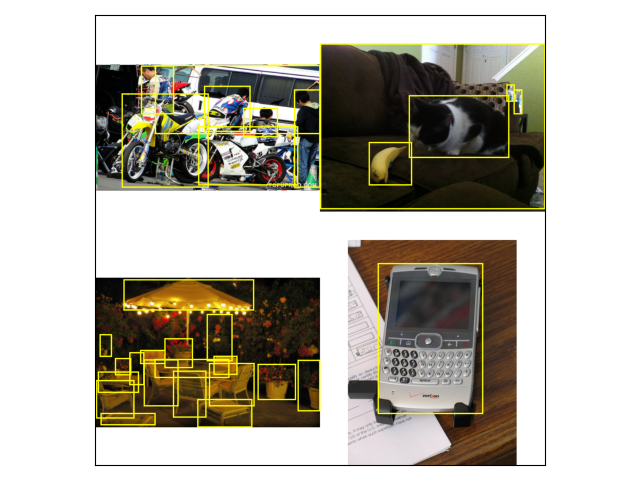
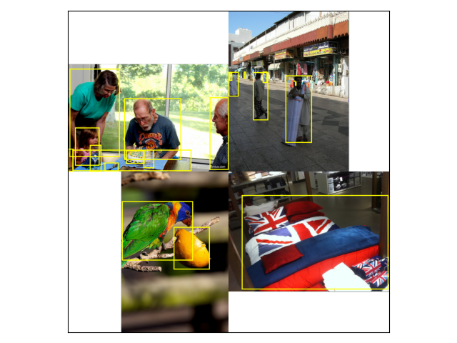
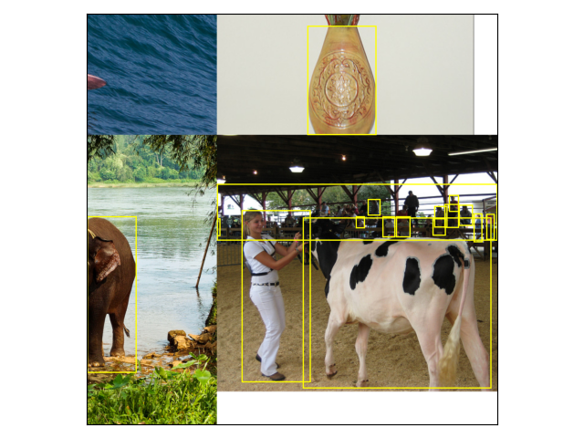
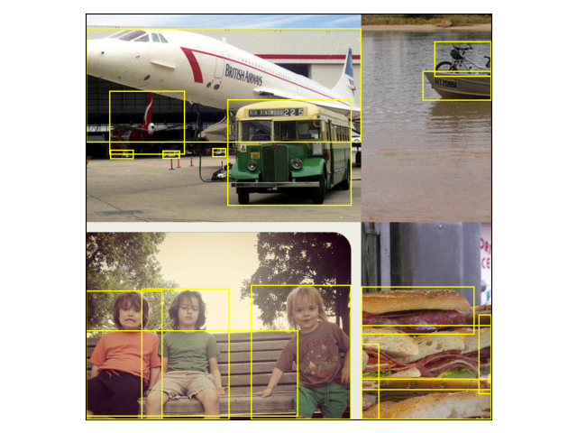

# Mosaic Augmentation Implemented in Pytorch

Mosaic data augmentation technique introduced in [YOLOv4 paper](https://arxiv.org/abs/2004.10934).

Warning: sometimes, due to cropping, it seems that all bounding boxes are removed which causes an error. Thus, perform the operation in a `try/except` block.

## Mosaic Construction Steps

The following steps are taken to construct a mosaic; for group of four images in a batch:
1. pad to square;
2. resize to fit;
3. join the images;
4. random crop of the joined images.

This basic approach has a downside, namely, for dataset with images of various aspect ratios, there will be a lot of padding in the final mosaic.

First, to reduce the amount of padding in the final crop, an option to add padding on the "outside" of each image in the mosaic was added. (Left: standard "centre pad". Right: "outside" pad.)

<table><tr>
<td>  </td>
<td>  </td>
</tr></table>
NB: The above images are not cropped after joining for the sake of visualisation.

Second, `IntelligentSquareResize` was added. It allows to crop the image to square before resizing or crop to square only images with aspect ratio greater than the user-defined threshold.
Example of each of the two methods can be seen below (Left: aspect ratio threshold of `1.2`. Right: cropped to square.).

<table><tr>
<td>  </td>
<td>  </td>
</tr></table>

## Use Example

Can be used in the same way as `torchvision.transforms.v2.MixUp` or `Cutmix` transforms.

```python
model = ...
model.train()

data_loader = ...

mosaic = Mosaic(
    output_size=1000,
    min_possible_image_area=0.25,
    centre_pad=False,
    crop=True,
    bbox_removal_threshold=0.02,
    intelligent_resize=True,
    max_aspect_ratio=1.2,
    crop_to_square=False,
)

for epoch in range(100):
    for images, targets in data_loader:
        try:
            images, targets = mosaic(images, targets)
        except:
            pass 

        images = [image.to(device) for image in images]
        targets = [{k: v.to(device) if isinstance(v, torch.Tensor) else v for k, v in t.items()} for t in targets]
        with torch.cuda.amp.autocast(enabled=scaler is not None):
            loss_dict = model(images, targets)
            losses = sum(loss for loss in loss_dict.values())
        ...
```

It is recommended to use batch size divisible by $4$.
